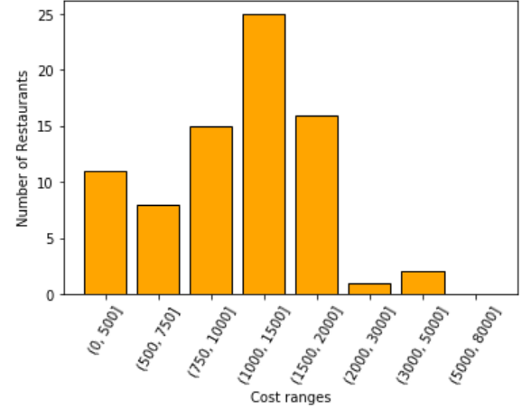
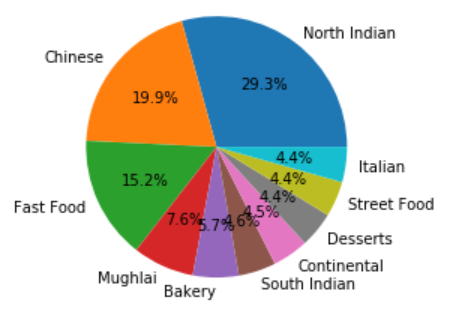
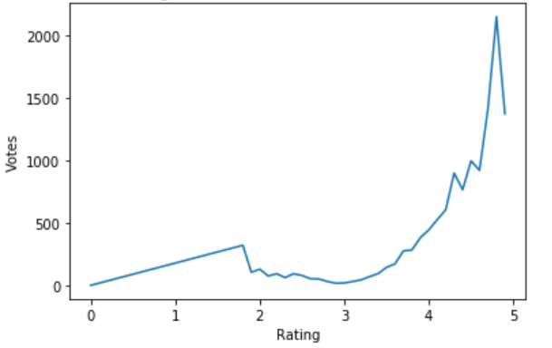

# Bon-Appetit

Gain insights about various restaurants, their cuisines, ratings, votes etc. Data is extracted from [Zomato API](https://developers.zomato.com/documentation). View rest of my projects [here](https://shivam360d.github.io/ShivamVats/).

### Data Visualizations

Below are the major data visualizations done for different features of the dataset using Matplotlib.

### 1. Distribution of resturants with rating > 4.5

### 2. Distribution of top 10 cuisines in Delhi NCR

### 3. Variation of number of resturant votes with rating

